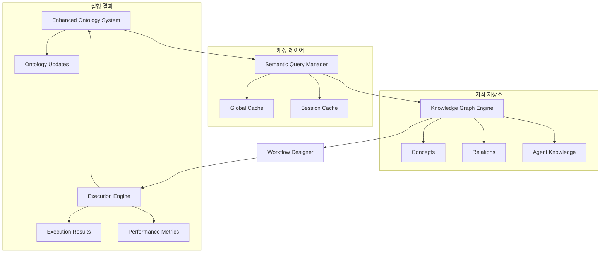

# 🧩 온톨로지 시스템 핵심 컴포넌트

## 📋 컴포넌트 개요

LogosAI 온톨로지 시스템은 5개의 핵심 컴포넌트로 구성되어 있으며, 각각이 특화된 역할을 수행하여 전체 시스템의 지능적 동작을 가능하게 합니다.

## 🧠 1. Enhanced Ontology System (메인 시스템)

### 📁 파일 위치
```
logos_server/app_agent/enhanced_ontology_system.py
```

### 🎯 주요 역할
- 전체 시스템의 중앙 제어 및 조정
- LLM 기반 종합 쿼리 분석
- 컴포넌트 간 데이터 흐름 관리
- 최종 결과 통합 및 반환

### 🏗️ 핵심 클래스

#### EnhancedOntologySystem
```python
class EnhancedOntologySystem:
    """🧠 향상된 온톨로지 시스템 - 모든 문제점 해결"""
    
    def __init__(self, email: str, prompt: str, sessionid: str = None, projectid: str = None):
        # LLM 인스턴스 초기화
        self._initialize_llm_instances()
        
        # 온톨로지 컴포넌트 초기화
        self.ontology_engine = LLMOntologyReasoningEngine()
        self.knowledge_builder = LLMKnowledgeGraphBuilder(self.ontology_engine)
        self.workflow_designer = LLMSemanticWorkflowReasoner(self.ontology_engine, self.knowledge_builder)
        self.semantic_query_manager = SemanticQueryManager(self.ontology_engine)
        self.execution_engine = EnhancedExecutionEngine(self._call_agent)
```

#### QueryAnalysisResult
```python
@dataclass
class QueryAnalysisResult:
    """쿼리 분석 결과"""
    semantic_query: SemanticQuery
    execution_strategy: ExecutionStrategy
    agent_mappings: Dict[str, List[str]]  # 쿼리 부분별 에이전트 매핑
    message_transformations: Dict[str, str]  # 에이전트별 메시지 변환
    ui_integration_plan: Dict[str, Any]  # UI/UX 통합 계획
    confidence: float = 0.8
```

### 🔄 주요 메서드

#### process_query()
```python
async def process_query(self, progress_callback=None) -> AsyncGenerator[Dict[str, Any], None]:
    """🚀 메인 쿼리 처리 - 모든 문제점 해결"""
    
    # 1. 종합적 쿼리 분석 (LLM 활용)
    analysis_result = await self._analyze_query_comprehensively()
    
    # 2. 동적 워크플로우 계획 생성
    workflow_plan = await self._create_dynamic_workflow_plan(analysis_result)
    
    # 3. 지능적 실행 전략 적용
    execution_results = await self._execute_intelligent_workflow(workflow_plan, analysis_result)
    
    # 4. 의미론적 결과 통합
    integrated_result = await self._integrate_results_semantically(execution_results, analysis_result)
    
    # 5. 온톨로지 업데이트
    await self._update_ontology_knowledge(analysis_result, workflow_plan, execution_results, integrated_result)
```

---

## 🕸️ 2. Ontology Knowledge Graph Engine

### 📁 파일 위치
```
logos_server/app_agent/ontology_knowledge_graph_engine.py
```

### 🎯 주요 역할
- 지식 그래프 구축 및 관리
- 의미론적 쿼리 분석
- 에이전트 지식 등록 및 관리
- 온톨로지 추론 수행

### 🏗️ 핵심 클래스

#### LLMOntologyReasoningEngine
```python
class LLMOntologyReasoningEngine:
    """LLM 기반 온톨로지 추론 엔진"""
    
    def __init__(self):
        # LLM 인스턴스 초기화
        self.llm = get_gpt4o_mini()
        self.reasoning_llm = get_reasoning_llm()
        
        # 온톨로지 그래프 (NetworkX MultiDiGraph 사용)
        self.graph = nx.MultiDiGraph()
        
        # 개념 및 관계 저장소
        self.concepts: Dict[str, OntologyConcept] = {}
        self.relations: Dict[str, OntologyRelation] = {}
```

#### LLMKnowledgeGraphBuilder
```python
class LLMKnowledgeGraphBuilder:
    """LLM 기반 지식 그래프 구축기"""
    
    async def register_agent_knowledge(self, agent_data: Dict[str, Any]):
        """에이전트 지식을 온톨로지에 등록"""
        
        # 에이전트 개념 생성
        agent_concept = OntologyConcept(
            concept_id=agent_data["agent_id"],
            concept_type=ConceptType.AGENT,
            name=agent_data.get("name", agent_data["agent_id"]),
            properties=agent_data
        )
        
        # 능력 관계 생성
        for capability in agent_data.get("capabilities", []):
            self.ontology.add_relation(
                agent_data["agent_id"],
                RelationType.HAS_CAPABILITY,
                capability,
                weight=0.9
            )
```

#### SemanticQuery
```python
@dataclass
class SemanticQuery:
    """의미론적 쿼리"""
    query_id: str
    original_query: str
    intent: str
    entities: List[str]
    concepts: List[str]
    complexity: str
    domain: str
    query_type: str
    confidence: float
    timestamp: datetime
    session_id: str
```

### 🔄 주요 메서드

#### analyze_semantic_query()
```python
async def analyze_semantic_query(self, query: str, session_id: str) -> SemanticQuery:
    """의미론적 쿼리 분석"""
    
    # LLM을 통한 쿼리 분석
    analysis_prompt = self._create_query_analysis_prompt(query)
    response = await self.llm.ainvoke(analysis_prompt)
    
    # 분석 결과 파싱
    analysis_result = self._parse_analysis_response(response.content)
    
    return SemanticQuery(
        query_id=f"query_{uuid.uuid4().hex[:8]}",
        original_query=query,
        intent=analysis_result["intent"],
        entities=analysis_result["entities"],
        concepts=analysis_result["concepts"],
        complexity=analysis_result["complexity"],
        domain=analysis_result["domain"],
        query_type=analysis_result["query_type"],
        confidence=analysis_result["confidence"],
        timestamp=datetime.now(),
        session_id=session_id
    )
```

---

## 🌊 3. Ontology Workflow Designer

### 📁 파일 위치
```
logos_server/app_agent/ontology_workflow_designer.py
```

### 🎯 주요 역할
- LLM 기반 워크플로우 설계
- 병렬 처리 최적화 분석
- 적응형 워크플로우 기능
- 성능 예측 및 모니터링

### 🏗️ 핵심 클래스

#### LLMSemanticWorkflowReasoner
```python
class LLMSemanticWorkflowReasoner:
    """LLM 기반 의미론적 워크플로우 추론기"""
    
    def __init__(self, ontology_engine: LLMOntologyReasoningEngine,
                 knowledge_builder: LLMKnowledgeGraphBuilder):
        # 다양한 용도별 LLM 인스턴스 초기화
        self.workflow_llm = get_gpt4o()  # 워크플로우 설계용
        self.analysis_llm = get_gpt4o_mini()  # 분석용
        self.reasoning_llm = get_reasoning_llm()  # 추론용
        self.creative_llm = get_creative_llm()  # 창의적 작업용
```

#### SemanticWorkflowStep
```python
@dataclass
class SemanticWorkflowStep:
    """의미론적 워크플로우 단계"""
    step_id: str
    semantic_purpose: str
    required_concepts: List[str]
    agent_id: str
    estimated_complexity: WorkflowComplexity
    prerequisites: List[str] = field(default_factory=list)
    depends_on: List[str] = field(default_factory=list)
    outputs: List[str] = field(default_factory=list)
    confidence: float = 1.0
    execution_context: Dict[str, Any] = field(default_factory=dict)
    alternative_agents: List[str] = field(default_factory=list)
    estimated_time: float = 30.0
```

#### OntologyWorkflowPlan
```python
@dataclass
class OntologyWorkflowPlan:
    """온톨로지 기반 워크플로우 계획"""
    plan_id: str
    semantic_query: SemanticQuery
    steps: List[SemanticWorkflowStep]
    execution_graph: nx.DiGraph
    optimization_strategy: OptimizationStrategy
    estimated_quality: float
    estimated_time: float
    reasoning_chain: List[str]
    alternative_plans: List['OntologyWorkflowPlan'] = field(default_factory=list)
```

### 🔄 주요 메서드

#### design_semantic_workflow()
```python
async def design_semantic_workflow(self, semantic_query: SemanticQuery,
                                 available_agents: List[str],
                                 optimization_strategy: OptimizationStrategy = OptimizationStrategy.BALANCED) -> OntologyWorkflowPlan:
    """의미론적 워크플로우 설계"""
    
    # 에이전트 정보 수집
    agents_info = await self._collect_agents_information(available_agents)
    
    # LLM 기반 워크플로우 설계
    design_result = await self._design_workflow_with_llm(semantic_query, agents_info, optimization_strategy)
    
    # 워크플로우 단계 생성
    workflow_steps = await self._create_workflow_steps(design_result, semantic_query)
    
    # 실행 그래프 구축
    execution_graph = self._build_execution_graph(design_result, workflow_steps)
    
    return OntologyWorkflowPlan.create_safe_workflow_plan(
        plan_id=f"plan_{uuid.uuid4().hex[:8]}",
        semantic_query=semantic_query,
        steps=workflow_steps,
        optimization_strategy=optimization_strategy,
        execution_graph=execution_graph
    )
```

---

## ⚡ 4. Enhanced Execution Engine

### 📁 파일 위치
```
logos_server/app_agent/enhanced_execution_engine.py
```

### 🎯 주요 역할
- 다양한 실행 전략 지원
- 데이터 변환 및 전달
- 성능 메트릭 수집
- 복잡도 기반 최적화

### 🏗️ 핵심 클래스

#### EnhancedExecutionEngine
```python
class EnhancedExecutionEngine:
    """향상된 실행 엔진"""
    
    def __init__(self, agent_caller: Callable):
        self.agent_caller = agent_caller
        self.data_transformer = DataTransformer()
        self.complexity_analyzer = QueryComplexityAnalyzer()
        self.execution_metrics = ExecutionMetrics()
```

#### ExecutionStrategy
```python
class ExecutionStrategy(Enum):
    """실행 전략"""
    SINGLE_AGENT = "single_agent"    # 단일 에이전트
    SEQUENTIAL = "sequential"        # 순차 실행
    PARALLEL = "parallel"           # 병렬 실행
    HYBRID = "hybrid"               # 혼합 실행
```

#### AgentExecutionResult
```python
@dataclass
class AgentExecutionResult:
    """에이전트 실행 결과"""
    agent_id: str
    success: bool
    data: Any
    error_message: str = ""
    execution_time: float = 0.0
    confidence: float = 1.0
    metadata: Dict[str, Any] = field(default_factory=dict)
    agent_type: Optional[str] = None
```

### 🔄 주요 메서드

#### execute_workflow()
```python
async def execute_workflow(self, semantic_query: SemanticQuery, 
                         workflow_plan: OntologyWorkflowPlan,
                         session_id: str) -> List[AgentExecutionResult]:
    """워크플로우 실행"""
    
    # 실행 전략 결정
    strategy = self._determine_execution_strategy(workflow_plan)
    
    # 전략별 실행
    if strategy == ExecutionStrategy.SINGLE_AGENT:
        return await self._execute_single_agent(workflow_plan, session_id)
    elif strategy == ExecutionStrategy.SEQUENTIAL:
        return await self._execute_sequential(workflow_plan, session_id)
    elif strategy == ExecutionStrategy.PARALLEL:
        return await self._execute_parallel(workflow_plan, session_id)
    elif strategy == ExecutionStrategy.HYBRID:
        return await self._execute_hybrid(workflow_plan, session_id)
```

---

## 💾 5. Semantic Query Manager

### 📁 파일 위치
```
logos_server/app_agent/semantic_query_manager.py
```

### 🎯 주요 역할
- 쿼리 캐싱 및 관리
- 세션 기반 캐시
- 분석 메트릭 수집
- 자동 캐시 정리

### 🏗️ 핵심 클래스

#### SemanticQueryManager
```python
class SemanticQueryManager:
    """의미론적 쿼리 관리자"""
    
    def __init__(self, ontology_engine: LLMOntologyReasoningEngine):
        self.ontology_engine = ontology_engine
        self.global_cache: Dict[str, CachedSemanticQuery] = {}
        self.session_caches: Dict[str, Dict[str, CachedSemanticQuery]] = {}
        self.cache_lock = asyncio.Lock()
        self.metrics = {
            "total_queries": 0,
            "cache_hits": 0,
            "cache_misses": 0,
            "analysis_times": []
        }
```

#### CachedSemanticQuery
```python
@dataclass
class CachedSemanticQuery:
    """캐시된 의미론적 쿼리"""
    semantic_query: SemanticQuery
    created_at: datetime
    last_accessed: datetime
    access_count: int
    session_id: str
    cache_key: str
```

### 🔄 주요 메서드

#### get_semantic_query()
```python
async def get_semantic_query(self, query: str, session_id: str) -> SemanticQuery:
    """의미론적 쿼리 가져오기 (캐시 우선)"""
    
    cache_key = self._generate_cache_key(query, session_id)
    
    # 캐시 확인
    cached_query = await self._get_from_cache(cache_key, session_id)
    if cached_query:
        self.metrics["cache_hits"] += 1
        return cached_query.semantic_query
    
    # 캐시 미스 - 새로 분석
    self.metrics["cache_misses"] += 1
    start_time = time.time()
    
    semantic_query = await self.ontology_engine.analyze_semantic_query(query, session_id)
    
    analysis_time = time.time() - start_time
    self.metrics["analysis_times"].append(analysis_time)
    
    # 캐시에 저장
    await self._store_in_cache(cache_key, semantic_query, session_id)
    
    return semantic_query
```

## 🔗 컴포넌트 간 상호작용

### 데이터 흐름


### 메서드 호출 체인
```python
# 1. 메인 시스템에서 시작
enhanced_system.process_query()

# 2. 쿼리 분석
semantic_query = semantic_query_manager.get_semantic_query(query, session_id)

# 3. 워크플로우 설계
workflow_plan = workflow_designer.design_semantic_workflow(semantic_query, agents)

# 4. 실행
execution_results = execution_engine.execute_workflow(semantic_query, workflow_plan)

# 5. 결과 통합 및 온톨로지 업데이트
integrated_result = enhanced_system._integrate_results_semantically(execution_results)
enhanced_system._update_ontology_knowledge(...)
```

## 📊 성능 특성

### 각 컴포넌트별 성능
| 컴포넌트 | 평균 처리 시간 | 메모리 사용량 | 캐시 효율성 |
|----------|----------------|---------------|-------------|
| Enhanced Ontology System | 5-8초 | 중간 | N/A |
| Knowledge Graph Engine | 1-2초 | 높음 | 85% |
| Workflow Designer | 2-3초 | 중간 | 70% |
| Execution Engine | 3-5초 | 낮음 | N/A |
| Query Manager | 0.1-0.5초 | 낮음 | 90% |

### 확장성 지표
- **동시 처리**: 최대 100개 세션
- **캐시 크기**: 세션당 최대 1000개 쿼리
- **지식 그래프**: 최대 10,000개 노드/엣지
- **워크플로우**: 최대 20단계 지원

## 🔧 설정 및 튜닝

### 성능 최적화 설정
```python
# 캐시 설정
CACHE_TTL = 300  # 5분
MAX_CACHE_SIZE = 1000
CLEANUP_INTERVAL = 3600  # 1시간

# LLM 설정
PRIMARY_LLM_TEMPERATURE = 0.3
ANALYSIS_LLM_TEMPERATURE = 0.1
REASONING_LLM_TEMPERATURE = 0.1

# 실행 설정
MAX_PARALLEL_AGENTS = 5
EXECUTION_TIMEOUT = 30
RETRY_COUNT = 3
```

### 모니터링 메트릭
```python
system_metrics = {
    "query_processing": {
        "total_queries": 1000,
        "avg_processing_time": 6.5,
        "success_rate": 0.95
    },
    "cache_performance": {
        "hit_rate": 0.85,
        "miss_rate": 0.15,
        "cache_size": 850
    },
    "ontology_growth": {
        "concepts_count": 500,
        "relations_count": 1200,
        "growth_rate": 0.1
    }
}
```

이러한 컴포넌트들이 유기적으로 협력하여 LogosAI의 온톨로지 시스템이 지능적이고 효율적인 멀티에이전트 처리를 가능하게 합니다. 