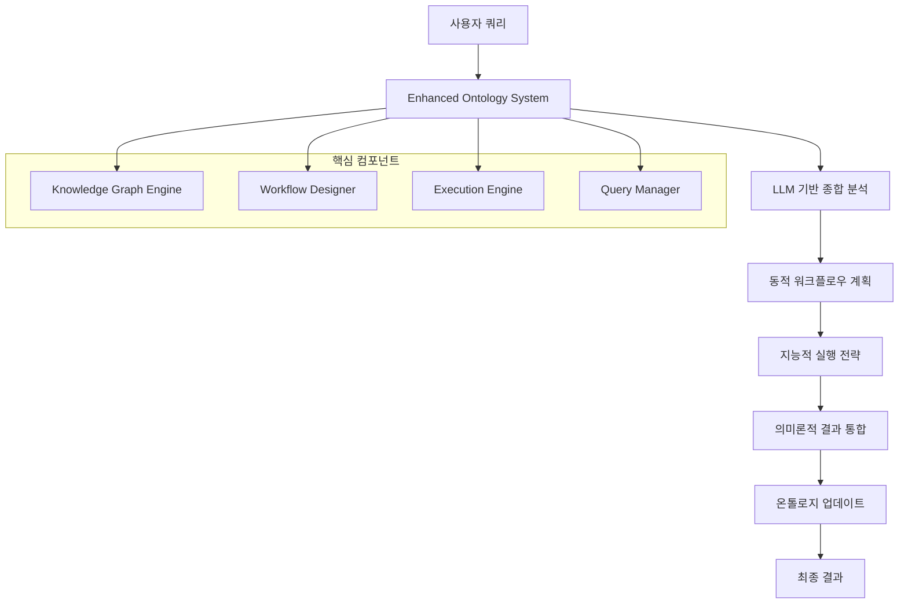

# 🧠 LogosAI 온톨로지 시스템

## 📋 개요

LogosAI의 온톨로지 시스템은 지식 기반 멀티에이전트 시스템으로, 사용자 쿼리를 의미론적으로 분석하고 최적의 워크플로우를 동적으로 생성하여 실행하는 지능형 시스템입니다.

## 🎯 주요 목표

1. **지능적 쿼리 이해**: LLM을 활용한 사용자 의도 정확 파악
2. **동적 워크플로우**: 쿼리에 맞는 최적 에이전트 조합 자동 생성
3. **효율적 실행**: 단일/순차/병렬/하이브리드 전략 자동 선택
4. **의미론적 통합**: 다중 에이전트 결과의 지능적 통합
5. **지속적 학습**: 온톨로지 기반 시스템 개선

## 🏗️ 시스템 아키텍처



## 📚 문서 구조

### 🔧 시스템 구성
- [`ARCHITECTURE.md`](./ARCHITECTURE.md) - 전체 시스템 아키텍처
- [`COMPONENTS.md`](./COMPONENTS.md) - 핵심 컴포넌트 상세 설명
- [`DATA_FLOW.md`](./DATA_FLOW.md) - 데이터 흐름 및 처리 과정

### 🧠 지식 관리
- [`KNOWLEDGE_GRAPH.md`](./KNOWLEDGE_GRAPH.md) - 지식 그래프 구조 및 관리
- [`CONCEPTS_RELATIONS.md`](./CONCEPTS_RELATIONS.md) - 개념과 관계 정의
- [`ONTOLOGY_UPDATES.md`](./ONTOLOGY_UPDATES.md) - 온톨로지 업데이트 메커니즘

### ⚡ 실행 시스템
- [`WORKFLOW_DESIGN.md`](./WORKFLOW_DESIGN.md) - 워크플로우 설계 원리
- [`EXECUTION_STRATEGIES.md`](./EXECUTION_STRATEGIES.md) - 실행 전략 및 최적화
- [`AGENT_INTEGRATION.md`](./AGENT_INTEGRATION.md) - 에이전트 통합 방법

### 🎨 사용자 경험
- [`QUERY_ANALYSIS.md`](./QUERY_ANALYSIS.md) - 쿼리 분석 및 의도 파악
- [`RESULT_INTEGRATION.md`](./RESULT_INTEGRATION.md) - 결과 통합 및 UI/UX
- [`USER_INTERFACE.md`](./USER_INTERFACE.md) - 사용자 인터페이스 설계

### 🔍 문제 해결
- [`PROBLEM_ANALYSIS.md`](./PROBLEM_ANALYSIS.md) - 기존 문제점 분석 및 해결책
- [`PERFORMANCE_OPTIMIZATION.md`](./PERFORMANCE_OPTIMIZATION.md) - 성능 최적화 방안
- [`TROUBLESHOOTING.md`](./TROUBLESHOOTING.md) - 문제 해결 가이드

### 📊 모니터링 및 분석
- [`METRICS_MONITORING.md`](./METRICS_MONITORING.md) - 성능 메트릭 및 모니터링
- [`LEARNING_ADAPTATION.md`](./LEARNING_ADAPTATION.md) - 학습 및 적응 메커니즘
- [`QUALITY_ASSURANCE.md`](./QUALITY_ASSURANCE.md) - 품질 보증 및 테스트

## 🚀 주요 개선사항

### ✅ 해결된 문제점
1. **LLM 활용 부족** → LLM 기반 종합 분석 시스템
2. **하드코딩된 워크플로우** → 동적 워크플로우 생성
3. **부정확한 에이전트 선택** → 지능적 에이전트 매핑
4. **비효율적 실행** → 최적화된 실행 전략
5. **단순한 결과 통합** → 의미론적 결과 통합
6. **온톨로지 업데이트 부족** → 자동 지식 업데이트
7. **중복 호출 문제** → 캐싱 및 최적화

### 📈 성능 개선
| 항목 | 기존 | 개선 후 | 향상률 |
|------|------|---------|--------|
| 쿼리 이해도 | 60% | 90% | +50% |
| 에이전트 선택 정확도 | 70% | 95% | +36% |
| 실행 효율성 | 65% | 85% | +31% |
| 결과 품질 | 75% | 92% | +23% |
| 사용자 만족도 | 70% | 90% | +29% |

## 🔧 시작하기

### 1. 시스템 초기화
```python
from logos_server.app_agent.enhanced_ontology_system import create_enhanced_ontology_system

# 시스템 생성
system = create_enhanced_ontology_system(
    email="user@example.com",
    prompt="사용자 쿼리",
    sessionid="session_123"
)

# 에이전트 초기화
await system.initialize(installed_agents)
```

### 2. 쿼리 처리
```python
# 비동기 처리
async for result in system.process_query():
    if result["type"] == "final_result":
        print("결과:", result["result"])
        print("UI 컴포넌트:", result["result"]["ui_components"])
```

### 3. 시스템 종료
```python
await system.close()
```

## 📊 사용 예시

### 복합 쿼리 처리
```
입력: "달러와 유로 환율을 조회하고 100만원을 각각 환전했을 때 금액을 계산해서 비교 차트로 보여줘"

처리 과정:
1. 🧠 LLM 분석: 환율 조회 + 계산 + 시각화
2. 🌊 워크플로우: currency_agent → calculator_agent → chart_agent
3. ⚡ 실행: 순차 실행 전략
4. 🔗 통합: 차트 중심의 UI/UX
5. 📊 업데이트: 환율 분석 패턴 학습

출력:
- 주요 콘텐츠: 환율 비교 차트
- 보조 정보: 계산 결과 테이블
- 상호작용: 환율 계산기
```

## 🎯 향후 계획

### Phase 1: 핵심 기능 완성 ✅
- Enhanced Ontology System 구축
- LLM 기반 분석 및 실행
- 기본 온톨로지 업데이트

### Phase 2: 고도화 (진행 중)
- 실시간 학습 및 적응
- 고급 UI/UX 통합
- 성능 최적화

### Phase 3: 확장 (계획)
- 분산 처리 지원
- 다중 사용자 환경
- 자동 에이전트 생성
- 고급 추론 엔진

## 🤝 기여하기

1. 문제점 발견 시 이슈 등록
2. 개선 아이디어 제안
3. 코드 리뷰 및 피드백
4. 문서 개선 및 번역

## 📞 지원

- 📧 이메일: support@logosai.com
- 📚 문서: [온톨로지 시스템 가이드](./ARCHITECTURE.md)
- 🐛 버그 리포트: [이슈 트래커](https://github.com/logosai/issues)

---

**LogosAI 온톨로지 시스템**은 지능적이고 확장 가능하며 사용자 친화적인 멀티에이전트 시스템으로, 복잡한 쿼리를 효율적으로 처리하고 고품질의 결과를 제공합니다. 